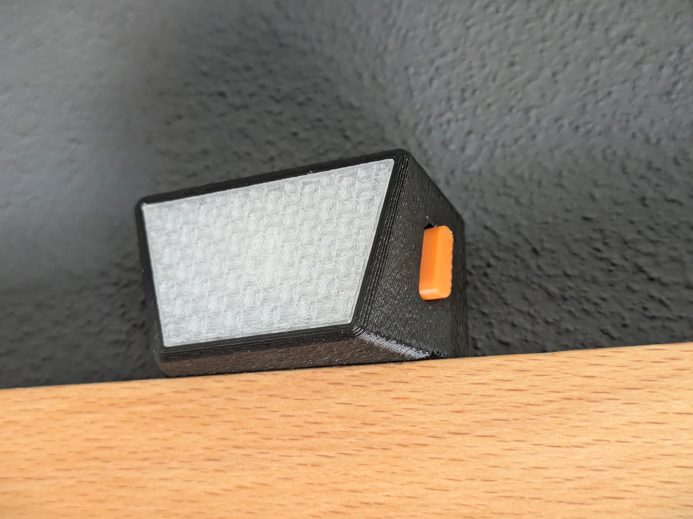

# Kanito Tally

Welcome to the Kanito Tally project. 

I built this because existing wireless tally systems for live video production are usually either prohibitively expensive or, in the DIY space, far too bulky and complicated to set up on site. The goal was simple: create an ultra-compact, reliable, and completely wireless tally light that fits in a 3x3cm enclosure, runs for a full 10-hour event on a tiny battery, and requires zero explanation for the camera operators using it.

Whether you are here to build one for your own multi-camera production, or I am reading this three years from now trying to remember how my own code works, this document covers the core architecture and design decisions of the project.

---

## The Hardware Approach

The physical footprint of this device is dictated by the battery and the microcontroller. To keep it as small as a matchbox without designing a custom PCB with microscopic SMD components, the hardware relies on highly integrated modules.

* **Microcontroller:** Seeed Studio XIAO ESP32-C6. This board is smaller than a postage stamp, features a highly efficient WiFi 6 chip, an integrated ceramic antenna, and a built-in lithium battery charging circuit.
* **Power:** A 380mAh Li-Ion battery (approx. 36x26x5mm). Sits flush right underneath the microcontroller.
* **Input:** A single tactile switch (Alps Alpine or RAFI RACON for a premium click feel).
* **Output:** An ultra-bright red LED (or a 4-pin common cathode RGB LED, supported via a hardware abstraction layer in the code).

To make a 380mAh battery last for 10 to 12 hours with active WiFi, the code aggressively utilizes the ESP32's hardware features: CPU underclocking, WiFi modem-sleep (turning off the radio between router beacons), and heavy reliance on the deep sleep mode when "turned off".

---

## Installation: The Web Flasher

Nobody likes downloading drivers, installing IDEs, and resolving library dependencies just to update a smart device. 

Kanito Tally utilizes the Web Serial API. You can flash the firmware directly from your browser (Chrome or Edge) without installing any software.

1. Connect the XIAO ESP32-C6 to your computer via USB-C.
2. Go to the Web Installer: **[Kanito Tally Web Installer](https://silas-hoerz.github.io/Kanito-Tally/web-installer/)**
3. Click "Install" and wait for the process to finish.

---

## Configuration & Network

Once flashed, the tally light needs to know how to connect to your production network and your video switcher. Hardcoding credentials is bad practice for touring event tech.

Instead, Kanito Tally uses a Captive Portal. 
If you boot the device into config mode, it acts as its own WiFi access point. Connect your phone to it, and a clean, responsive dark-mode web interface will pop up automatically.

From this web UI, you can select the operating mode:
* **Native Blackmagic ATEM:** Connects directly to an ATEM switcher via IP. Great for simple setups.
* **TallyArbiter:** Connects to a TallyArbiter server via WebSockets. This is the recommended mode, as it makes the tally compatible with vMix, OBS, NDI, and takes the network load off the hardware switcher.

---

## Operation: The Invisible Manual

Since there is only one button and one LED, the user interface relies on muscle memory and clear visual feedback. The interaction design is heavily inspired by the power buttons on DJI drones.

### State Machine Logic
* **Power On:** Press short, release, then press and hold for 2 seconds. The LED will fade in.
* **Power Off:** While on, press short, then press and hold. The LED fades out, and the ESP32 enters deep sleep (drawing less than 30µA).
* **Check Camera ID:** While connected (standby), press the button once. The LED will flash the assigned camera number (e.g., 3 rapid flashes for Camera 3).
* **Enter Config Mode:** From standby, press and hold for 4 seconds. The LED will switch to a pulsing "lighthouse" pattern, indicating the WiFi hotspot is active.

### LED Behavior
The LED behaves as follows during normal operation:
* **Booting/Searching:** Fast, even blinking.
* **Standby (Connected):** Very dim, slow breathing effect. Shows the operator the device hasn't frozen.
* **ON AIR (Live):** 100% solid red. (Software blocks all button inputs in this state except for emergency power off).

---

## Development & Building from Source

If you want to modify the C++ code:
The project is built using Visual Studio Code and the PlatformIO extension. It adheres to the Google C++ Style Guide for readability and maintainability.

Simply clone the repository, open the folder in PlatformIO, and hit build. All library dependencies (like `OneButton` and `ATEMmax`) will be resolved automatically. 

Enjoy your wireless production setup!
